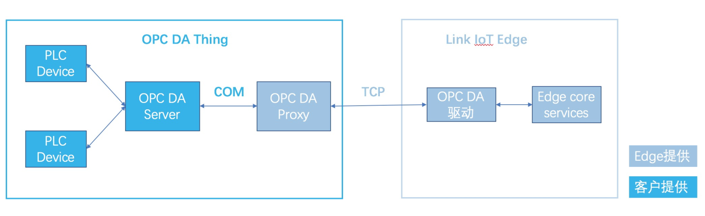

# 阿里云物联网边缘计算OPC DA驱动

## 驱动简介

OPC DA驱动是Link IoT Edge提供的可以接入通过OPC DA服务器对外提供服务的设备。由于OPC DA服务器仅支持Windows平台访问，而Link IoT Edge及OPC DA驱动都是运行在Linux环境，所以OPC DA驱动接入设备是通过一个运行在Windows平台的OPC DA代理实现的。连接详情见下图。


> 注：OPC DA驱动暂时仅支持在Link IoT Edge专业版运行。

---

## 生成驱动
``` sh
python3 package.py
```

---
## 文档手册
关于OPC DA驱动使用文档，请参考[OPC DA驱动用户手册](docs/OPCDA驱动使用手册.pdf)。


